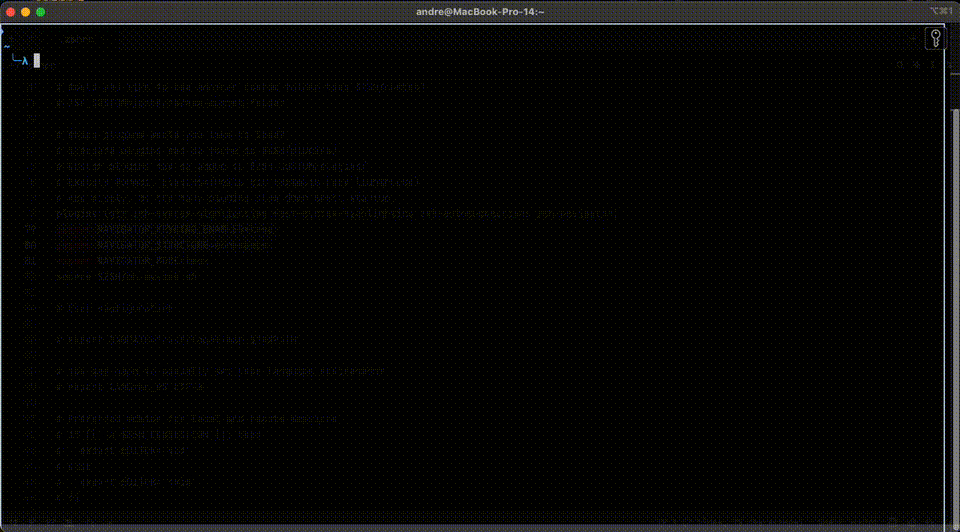

# Zsh Navigator Plugin

The `zsh-navigator` plugin allows you to quickly navigate your workspace using `fzf` and optionally manage `tmux` sessions or switch directories.

> Inspired by [ThePrimeagen](https://github.com/ThePrimeagen/.dotfiles/blob/602019e902634188ab06ea31251c01c1a43d1621/bin/.local/scripts/tmux-sessionizer) tmux-sessionizer script.

## Installation

### Using a Zsh Plugin Manager

1. **[Oh My Zsh](https://ohmyz.sh/)** or **[Zinit](https://github.com/zdharma-continuum/zinit)**:
    - Add the plugin to your `.zshrc`:
      zinit light Andree37/zsh-navigator
    - Or for Oh My Zsh:

```bash
git clone https://github.com/Andree37/zsh-navigator.git $ZSH_CUSTOM/plugins/zsh-navigator
```

Add the plugin to your `.zshrc`:

```bash
plugins=(zsh-navigator)
```

2. Reload your Zsh configuration:

```bash
source ~/.zshrc
```



---

## Configuration Options

### Overview

All configuration is done through `ZSH_NAVIGATOR_*` variables that can be set in your `.zshrc` file before loading the plugin. The plugin also provides a configuration utility for runtime changes.

| **Variable**                           | **Default**    | **Description**                                 | **Examples**                             |
| -------------------------------------- | -------------- | ----------------------------------------------- | ---------------------------------------- |
| `ZSH_NAVIGATOR_MODE`                   | `tmux`         | Set the navigation mode.                        | `tmux`, `cd`                             |
| `ZSH_NAVIGATOR_KEYBIND_ENABLED`        | `true`         | Enable keybindings.                             | `true`, `false`                          |
| `ZSH_NAVIGATOR_KEYBIND`                | `^f`           | Keybinding to launch the navigator.             | `^g`, `^n`                               |
| `ZSH_NAVIGATOR_ORIGINAL_PATH_KEYBIND`  | `^h`           | Keybinding to return to the original directory. | `^x`, `^o`                               |
| `ZSH_NAVIGATOR_STRUCTURE`              | `unsorted`     | Define the workspace structure.                 | `workspace`, `workspace_src`, `unsorted` |
| `ZSH_NAVIGATOR_BASE_DIR`               | `$HOME/github` | Set the base directory for navigation.          | `/path/to/projects`                      |
| `ZSH_NAVIGATOR_WINDOW_NAMING`          | `false`        | Enable automatic renaming of tmux windows.      | `true`, `false`                          |
| `ZSH_NAVIGATOR_HOME_PATH`              | `.`            | Default directory to return to.                 | `$HOME`, `/path/to/default`              |

---

### Configuration Method

Configure zsh-navigator by setting `ZSH_NAVIGATOR_*` variables in your `.zshrc` file **before** loading the plugin. This is the standard way that zsh plugins are configured (same pattern as zsh-autosuggestions, zsh-syntax-highlighting, etc.).

### Detailed Explanation

- **`ZSH_NAVIGATOR_MODE`**: Controls how the navigator operates (`tmux` for session management, `cd` for changing directories).
- **`ZSH_NAVIGATOR_KEYBIND_ENABLED`**: Toggles keybinding functionality (`true` to enable, `false` to disable).
- **`ZSH_NAVIGATOR_KEYBIND`**: Defines the keybinding for launching the navigator (default is `Ctrl+f`).
- **`ZSH_NAVIGATOR_ORIGINAL_PATH_KEYBIND`**: Sets the keybinding for returning to the original directory (default is `Ctrl+h`).
- **`ZSH_NAVIGATOR_STRUCTURE`**: Configures workspace organization (`workspace`, `workspace_src`, or `unsorted`).
- **`ZSH_NAVIGATOR_BASE_DIR`**: Specifies the root directory for navigation.
- **`ZSH_NAVIGATOR_WINDOW_NAMING`**: Enables or disables automatic renaming of the current tmux window based on the selected package name.
  - IMPORTANT that this option is only effective in `tmux` mode and it requires additional configuration in your `~/.tmux.conf` file to work properly. See the [tmux configuration section](#tmux-configuration) below for details.
- **`ZSH_NAVIGATOR_HOME_PATH`**: Default directory to return to when using the original path keybinding.

### Structure Options

The `ZSH_NAVIGATOR_STRUCTURE` variable allows you to define the structure of your workspace. The following options are available:

- **`workspace`**: Expects a workspace directory with subdirectories for each project. For example:

    ```
    ~/Projects
    ├── package1
    ├── package2
    ├── package3
    ```

- **`workspace_src`**: Expects a workspace directory with subdirectories for each project containing a `src` directory. For example:

    ```
      ~/Projects
      ├── src
      │   ├── package1
      │   ├── package2
      │   ├── package3
    ```

- **`unsorted`**: Does not expect any specific structure. All directories are listed without any assumptions and this is the default option.

---

### Example Configuration

#### Complete .zshrc Example

Here's a complete example of how to configure zsh-navigator in your `~/.zshrc`:

```bash
# Configure zsh-navigator BEFORE loading plugins
ZSH_NAVIGATOR_KEYBIND_ENABLED=true
ZSH_NAVIGATOR_STRUCTURE=workspace
ZSH_NAVIGATOR_MODE=tmux
ZSH_NAVIGATOR_WINDOW_NAMING=true
ZSH_NAVIGATOR_BASE_DIR="$HOME/Projects"
ZSH_NAVIGATOR_KEYBIND="^f"

# Load plugins
plugins=(git zsh-syntax-highlighting fast-syntax-highlighting zsh-autosuggestions zsh-navigator)

source $ZSH/oh-my-zsh.sh
```

#### Minimal Configuration

If you're happy with most defaults, you only need to set what you want to change:

```bash
# Only configure what you want to change
ZSH_NAVIGATOR_BASE_DIR="$HOME/Development"
ZSH_NAVIGATOR_STRUCTURE=workspace

plugins=(git zsh-navigator)
```


---

## Migration from Old Configuration

If you were using the old `NAVIGATOR_*` environment variables, you need to update your configuration:

### Old Configuration (no longer supported)
```bash
# OLD - Don't use this anymore
export NAVIGATOR_KEYBIND_ENABLED=true
export NAVIGATOR_STRUCTURE=workspace
export NAVIGATOR_MODE=tmux
export NAVIGATOR_WINDOW_NAMING=true

plugins=(zsh-navigator)
```

### New Configuration (current)
```bash
# NEW - Use this format
ZSH_NAVIGATOR_KEYBIND_ENABLED=true
ZSH_NAVIGATOR_STRUCTURE=workspace
ZSH_NAVIGATOR_MODE=tmux
ZSH_NAVIGATOR_WINDOW_NAMING=true

plugins=(zsh-navigator)
```

### What Changed
1. **Variable names**: Added `ZSH_` prefix to all variables. This matches other plugins
2. **No exports**: Remove `export` statements - just set the variables
3. **Order matters**: Variables must be set BEFORE the `plugins=()` line

---

## Usage

1. Run the navigator:

    - Manually: `navigator`
    - Or, if keybinding is enabled: Press your configured key (e.g., `Ctrl+f`).

2. Use `fzf` to select a directory.

3. Depending on the mode:
    - TMUX Mode: Opens or switches to a `tmux` session.
    - CD Mode: Navigates to the selected directory in your terminal.

## TMUX Configuration
To enable automatic renaming of tmux windows based on the selected package name, add the following to your `~/.tmux.conf`:

```bash
# Enable automatic renaming of tmux windows
set-option -g set-titles on
set-option -g set-titles-string "#W"
```
